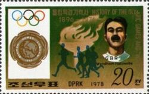
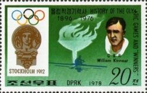
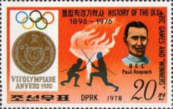
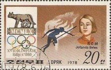

## Olympic stamp collection
Here is my current Olympic stamp collection! In the years, the first one is the year the stamp is about and the second is the one it was published in, if applicable.

 North Korea, 1908 (1978)
 North Korea, 1912 (1978)
 North Korea, 1920 (1978)

 Monaco, 1952(1953)

 Germany (Federal Republic), 1956

 North Korea, 1960 (1978)
 Paraguay, 1960
 Paraguay, 1960
 Italy, 1960

 Spain, 1964
 Spain, 1964

 Hungary, 1968
 Hungary, 1968
 Hungary, 1968
 Hungary, 1968
 Hungary, 1968